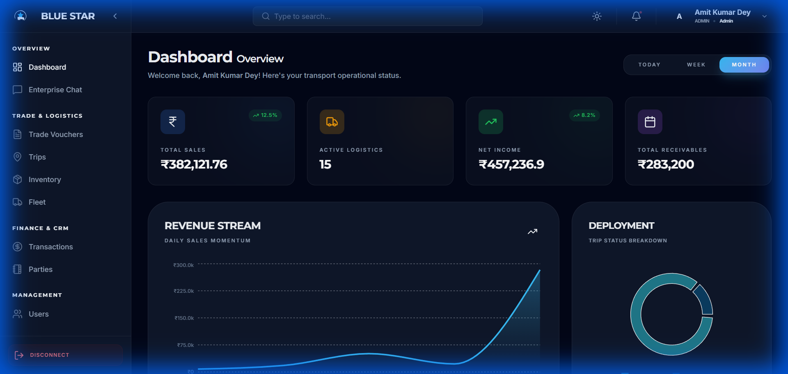
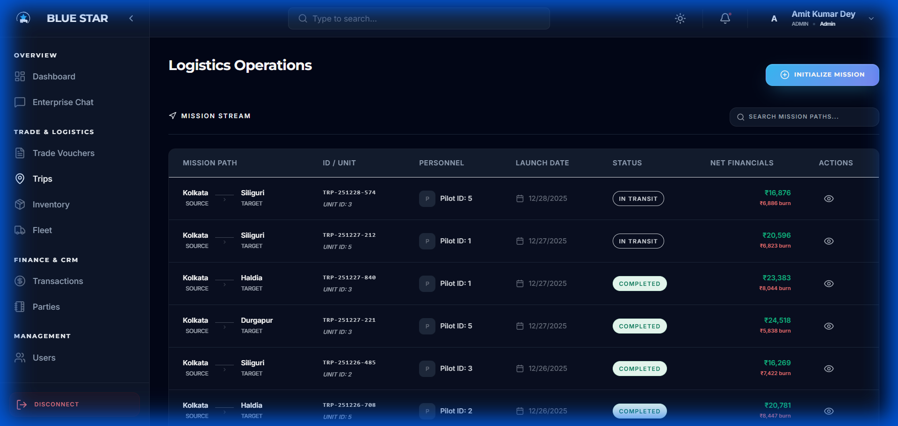
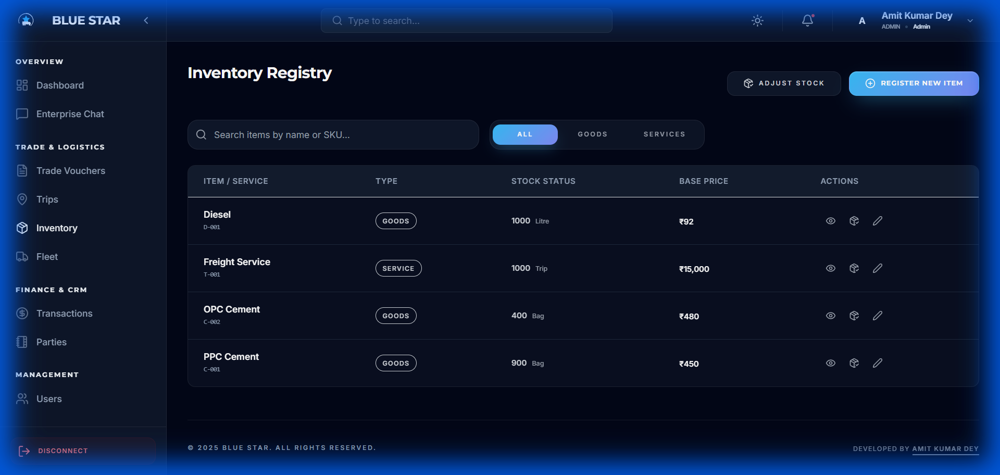
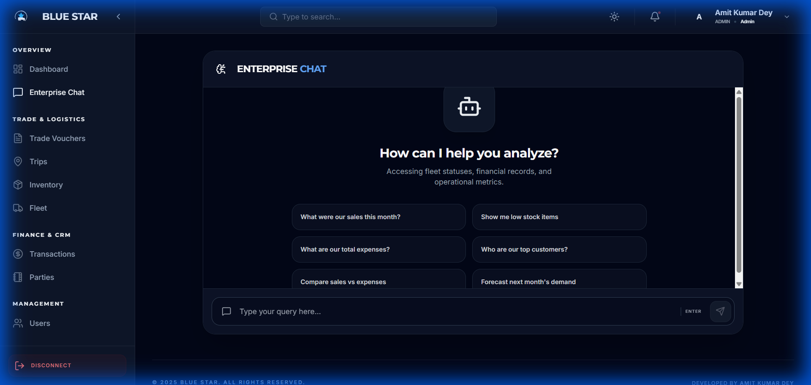

**This manual is created using Antigravity**

# BlueStar Trading & Transport System - User Manual

Welcome to the **BlueStar Trading & Transport System**, your premium solution for managing logistics, trading vouchers, inventory, and fleet operations. This manual guides you through using the application to maximize efficiency and control.

## 1. Getting Started

### Accessing the Application
Open your web browser and navigate to the application URL. You will be greeted by the **Login Page**.

### Logging In
To access the secure dashboard, you need to authenticate.
*   **Email**: `admin`
*   **Password**: `admin`

Enter these credentials and click **"Connect"**.

---

## 2. Dashboard Overview

The **Dashboard** is your command center. It provides real-time insights into your business's health.

*   **Key Metrics**: At the top, you see cards for **Total Sales**, **Active Logistics** (ongoing trips), **Net Income**, and **Total Receivables**.
*   **Revenue Stream**: A line chart visualizing your daily sales momentum over the month.
*   **Deployment**: A donut chart showing the breakdown of trip statuses (Coming Soon, In Transit, Completed).

---

## 3. Trade Vouchers

Navigate to **"Trade Vouchers"** in the sidebar to manage your financial documents.

This section acts as your central hub for:
*   **Quotations**: Use this for initial price offers.
*   **Challans**: For delivery confirmation.
*   **Invoices**: Final bills for goods.
*   **Bills**: General billing documents.

**Key Actions:**
*   **View**: Click the eye icon to see details of a voucher.
*   **Print**: Click the printer icon to generate a PDF ready for printing.
*   **Generate Voucher**: Use the blue button at the top right to create new documents.

---

## 4. Logistics Operations (Trips)

select **"Trips"** from the sidebar to monitor your fleet's missions.

This table tracks every shipment:
*   **Mission Path**: Shows the Source and Target destinations (e.g., Kolkata -> Siliguri).
*   **ID / Unit**: Unique identifiers for the trip and unit (truck).
*   **Personnel**: The pilot (driver) assigned to the mission.
*   **Status**: Quickly checks if a trip is `In Transit` or `Completed`.
*   **Net Financials**: View the revenue and "burn" (expenses) for each trip.
*   **Initialize Mission**: Use this button to start a new logistics operation.

---

## 5. Inventory Registry

manage your stock levels in the **"Inventory"** section.

Here you can track:
*   **Goods**: Physical items like Diesel, Cement, etc.
*   **Services**: Intangible offerings like Freight Services.
*   **Stock Status**: Real-time quantity available (e.g., 1000 Litre, 400 Bag).
*   **Base Price**: The standard unit price for items.
*   **Adjust Stock**: Use this to correct stock levels manually.
*   **Register New Item**: Add new products or services to your system.

---

## 6. Fleet Management

The **"Fleet"** section helps you maintain your vehicles and drivers.

*   **Vehicles Registry**: A list of all trucks (`WB25-8985` etc.) with their ownership status (`Internal` vs. External).
*   **Status**: See which trucks are `Available` for missions.
*   **Docs Health**: Monitor if compliance documents (Insurance, Pollution, etc.) are up to date.
*   **Register New Vehicle**: Add new trucks to your fleet.

---

## 7. Enterprise Chat (AI Assistant)

For deep analysis, use the **"Enterprise Chat"**.

This is an AI-powered assistant designed to answer questions about your data. You can ask things like:
*   "What were our sales this month?"
*   "Show me low stock items"
*   "Who are our top customers?"

Just type your query in the chat box and press enter to get instant insights.

---

## 8. Support

For technical issues, customization requests, or further assistance, please contact the developer:

**Amit Kumar Dey**
*   **Role**: Lead Developer / Admin
*   **System**: BlueStar Trading & Transport System v2.0

---

*© 2025 Blue Star. All Rights Reserved.*
